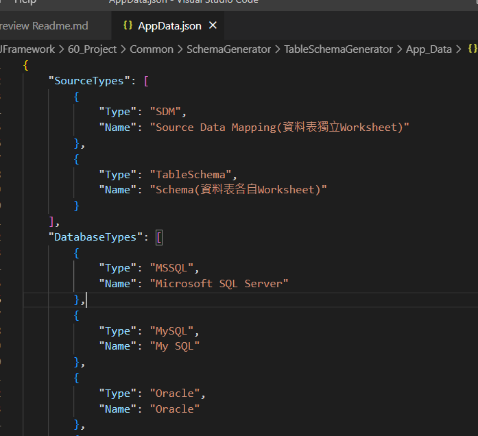
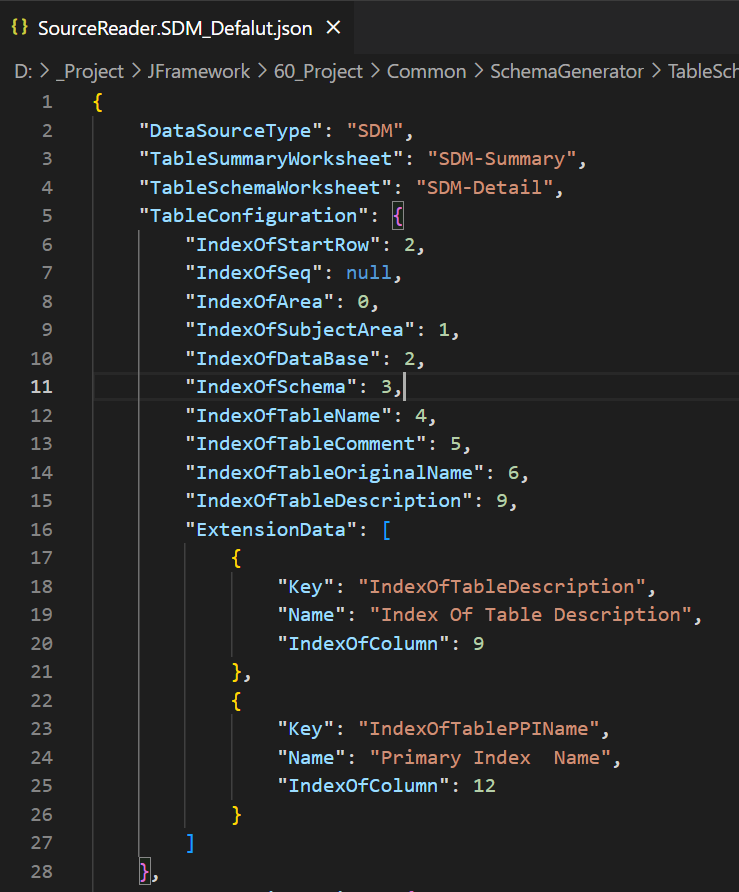
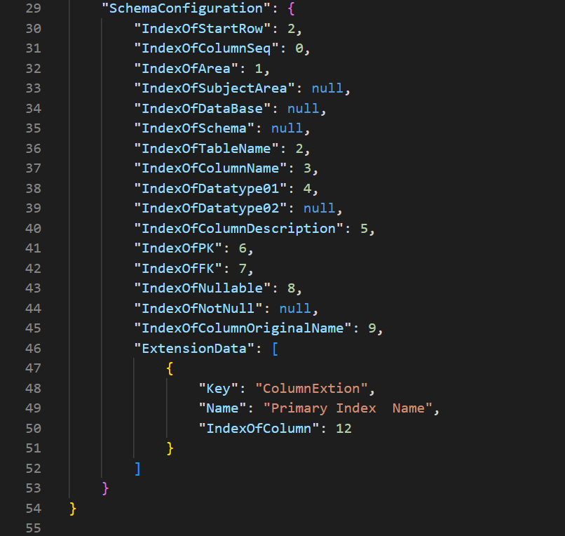

# Table Schema Generator (Create Table DDL SQL 工具)
## 需求情境
#### 一、因專案資料庫結構文件為Excel，以前習慣用Excel VAB寫自動產生 Create Table DDL SQL，因目前其他專案有不同Excel格式就要改一次VBA。因此寫一個共用的程式，透過設定檔來調整欄位
* 工具下載：  
  * Win x64 可攜式(23MB)：[TableSchemaGenerator_v3.0.zip](https://drive.google.com/file/d/1OKg_0T7pyAeFG_WvDgaMpqtcau_t1mZC/view?usp=sharing)

#### 二、目前支援的格式
* 來源：目前支援2種不同Excel格式  
    1. SDM：Table列表一個Worksheet，Column也全部在一個worksheet，共 2 個Worksheets；(資料表獨立Worksheet)
    2. TableSchema：Table列表一個Worksheet，Column Schema Table 各自一個worksheet，共 1+ N(Column Schema) 個Worksheets；(資料表各自Worksheet)
* 目的：
    1. MSSQL：Microsoft SQL Server
    2. MSAzureSynapse：Microsoft Azure Synapse
    3. Oracle
    4. MYSQL：My SQL

## 相關範本及設定檔說明
#### 一、範本檔  
Template路徑：  
* (1) 預設*.json檔路徑：\TableSchemaGenerator\App_Data\*.json檔  
      i.  [SDM格式類型(資料表獨立Worksheet)](TableSchemaGenerator\App_Data\SourceReader.SDM_Defalut.json)  
      ii. [Table Schema格式類型(資料表各自Worksheet)](TableSchemaGenerator\App_Data\SourceReader.TableSchema.json) 
* (2) Excel 檔：\TableSchemaGenerator\Template\ Excel檔  
      i.  [SDM格式類型(資料表獨立Worksheet)](TableSchemaGenerator\Template\SDM_MIS.xlsx)  
      ii. [Table Schema格式類型(資料表各自Worksheet)](TableSchemaGenerator\Template\TableSchema.xls)

#### 二、AppData.json 設定檔
1. 若使用設定檔，下拉選單會自動對應設定檔
2. 若無設定/對應，即顯示元件ddl Type名稱

 | 項目 | 資料型別 | 說明 | 備註 |
| ----------------------- | ------------------ |---------------------------- | ----------------------------- |
| SourceType | object[] | 資料來源類型 | |
| DatabaseTypes | object[] | 資料目的類型 | |
|  | object[] | 資料來項目物件定義 | |
| Type | string | 資料來項、目的的類型 | ex:SDM、TableSchema、MSSQL...etc。必須與元件{typename}相同 |
| Name | string | 用來說明的名稱或描述 |  |

#### 三、Source Reader json 設定檔
    1. SourceRead*.josn：設定資料來源格式  
        設定檔命名規則為：〝SourceReader.{TypeName}_{Name}.json〞
        i.  {TypeName}：類型代碼 ex: SDM、TableSchema      
        ii. {Name}：自定義區別的名稱  
        iii. 設定檔 index 起始值為0 
    
    2.  一般資料設定

 | 項目 | 資料型別 | 說明 | 備註 |
| --------------------------- | -------------- |----------------------- | ---------------------------------- |
| DataSourceType | String | 資料來源類型 | ex:SDM、TableSchema |
| TableSummaryWorksheet | String | 資料表列表 worksheet name | ex:SDM-Summary |    
| TableSchemaWorksheet | String | 資料表欄位 worksheet name | ex:SDM-Detail |

    3.  資料表資訊設定

 | 項目 | 資料型別 | 說明 | 備註 |
| --------------------------- | -------------- |----------------------- | ---------------------------------- |
| TableConfiguration | Object | 資料表資料欄設定資料 | 下列IndexOf欄位若無設成null |
| IndexOfStartRow | Integer | 資料起始列，由0開始 |  |
| IndexOfSeq | Integer | 序號欄位索引值 |  |
| IndexOfArea | Integer | 主要分類欄位索引值 |  |
| IndexOfSubjectArea | Integer | 子分類欄位索引值 |  |
| IndexOfDataBase | Integer | 資料庫欄位索引值 |  |
| IndexOfSchema | Integer | 資料結構欄位索引值 |  |
| IndexOfTableName | Integer | 資料表名稱欄位索引值 |  |
| IndexOfTableComment | Integer | 資料表說明欄位索引值 |  |
| IndexOfTableOriginalName | Integer | 資料表原始名稱欄位索引值 |  |
| IndexOfTableDescription | Integer | 資料表其他描述欄位索引值 |  |
| ExtensionData | Object | 其他擴充欄位資訊欄 |  |
| Key | String | 擴充欄位鍵值 | 英文命名 |
| Name | String | 名稱 |  |
| IndexOfColumn | Integer | 擴充欄位索引值 |  |

    4.  欄位資料設定

 | 項目 | 資料型別 | 說明 | 備註 |
| --------------------------- | -------------- |----------------------- | ---------------------------------- |
| SchemaConfiguration | Object | 資料表欄位欄設定資料 | 下列IndexOf欄位若無設成null |
| IndexOfStartRow | Integer | 資料起始列，由0開始 |  |
| IndexOfColumnSeq | Integer | 序號欄位索引值 |  |
| IndexOfArea | Integer | 主要分類欄位索引值 |  |
| IndexOfSubjectArea | Integer | 子分類欄位索引值 |  |
| IndexOfDataBase | Integer | 資料庫欄位索引值 |  |
| IndexOfSchema | Integer | 資料結構欄位索引值 |  |
| IndexOfTableName | Integer | 資料表名稱欄位索引值 |  |
| IndexOfColumnName | Integer | 資料欄位名稱欄位索引值 |  |
| IndexOfDatatype01 | Integer | 資料型別欄位索引值-01 |  |
| IndexOfDatatype02 | Integer | 資料型別欄位索引值-02 | 有些文件會將Data Type 分成2欄就用到-02 |
| IndexOfColumnDescription | Integer | 資料欄描述欄位索引值 |  |
| IndexOfPK | Integer | Primary Key欄位索引值 |  |
| IndexOfFK | Integer | Foreigner Key欄位索引值 |  |
| IndexOfNullable | Integer | 是否能允許Null Value欄位索引值 | Null 與 Not Null 為二擇一 |
| IndexOfNotNull | Integer | 是否為Not Null 欄位索引值 |  |
| IndexOfColumnOriginalName | Integer | 資料欄原始名稱欄位索引值 |  |
| ExtensionData | Object | 其他擴充欄位資訊欄 |  |
| Key | String | 擴充欄位鍵值 | 英文命名 |
| Name | String | 名稱 |  |
| IndexOfColumn | Integer | 擴充欄位索引值 |  |

# DDL 產生器 程式功能 擴充規範
## 一、來源文件類型
    1. 需擴充新類型功能時，建立新類別專案命名規則為：〝SourceReader.{TypeName}〞
        i. {TypeName}：類型代碼 ex: SDM、TableSchema

    2. 需參考『SchemaGenerator.BaseFactory』專案
         i. 建立類別且繼承『SourceReaderBase』類別，並實作其方法
        ii. 類別名稱命名規範〝{TypeName}SourceReader〞

    3. 專案下建立『App_Data』資料夾，並建立〝SourceReader.{TypeName}.json〞
        i. {TypeName}：類型代碼 ex: SDM、TableSchema
        ii. *.json檔案屬性設定：建置動作=無；複製到輸出目錄=永遠複製
        iii. ps:另若該SDM格式，欄位順序有差異請自己修改 *.json檔，若有不用可自己備份，程式只會讀取上述命名規則的*.json檔
        iv. *.json設定檔裡的 index 起始值由"0"開始   

    4. 開發完後建置後將*.dll<必要>、*.pdb複製於主要程式專案目錄下『Extension』資料夾下，供程式自動判斷開啟擴充

    5. 如需要下拉選單顯示時有更完整名稱或說明，請在『App_Data』資料夾下〝AppData.json〞檔，
        開啟編輯並設定〝SourceTypes〞物件資料，若無此設定即顯示ddl Type名稱
            
    6. 資料來源檔案，若無從前端選取，ex: Excel SDM file :SDM_MIS.xlsx預設須放執行程式根目錄下的『Template』目錄下，

## 二、產生DDL DB類型
    1. 需擴充新類型功能時，建立新類別專案命名規則為：〝SchemaGenerator.{TypeName}〞
        i. {TypeName}：類型代碼 ex: MSSQL、Oracle、Teradata
    2. 需參考『SchemaGenerator.BaseFactory』專案 
         i. 建立類別且繼承『SchemaGeneratorBase』類別，並實作其方法
        ii. 類別名稱命名規範〝{TypeName}SchemaGenerator〞
    3. 開發完後建置後將*.dll<必要>、*.pdb複製於主要程式專案目錄下『Extension』資料夾下，供程式自動判斷開啟擴充